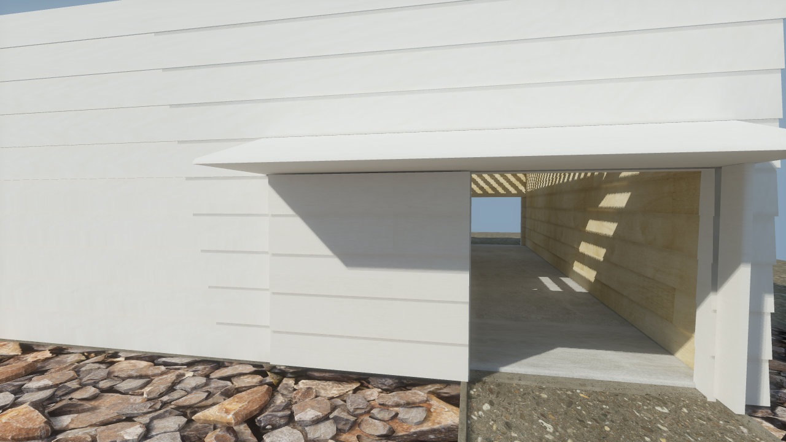
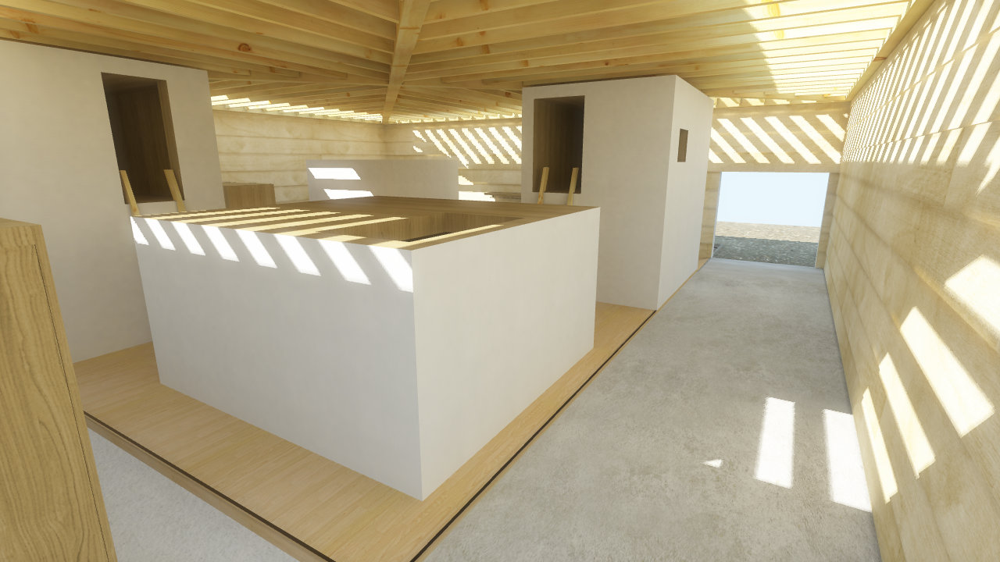
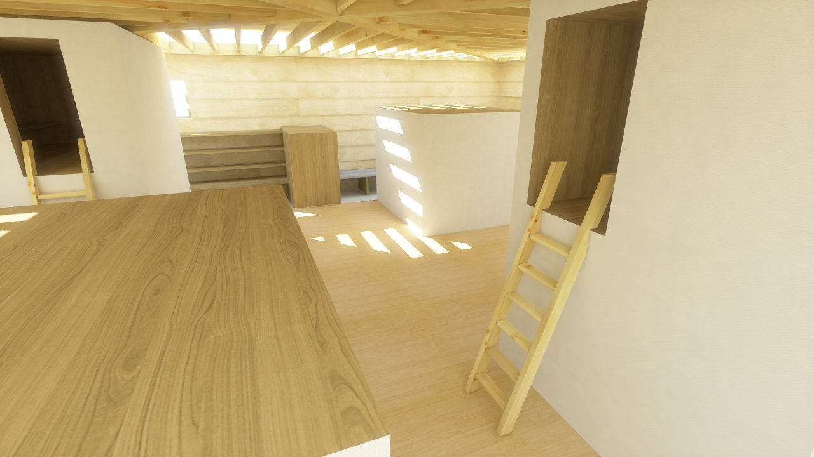
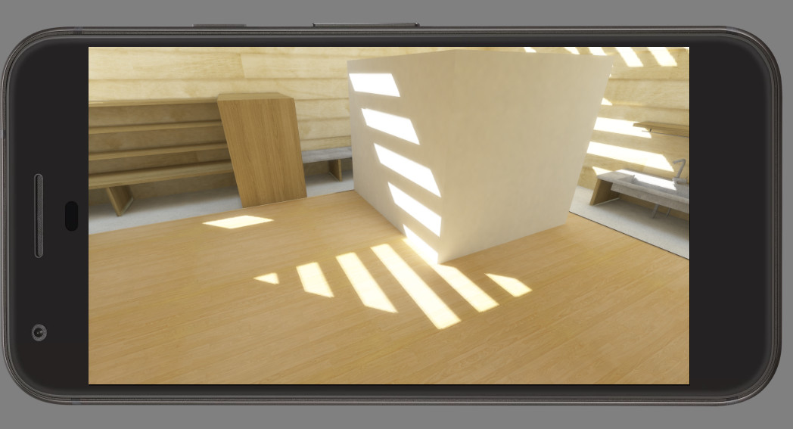
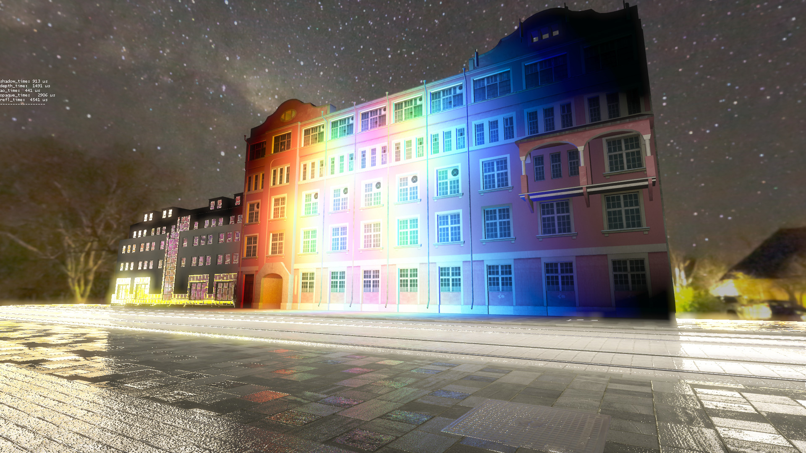
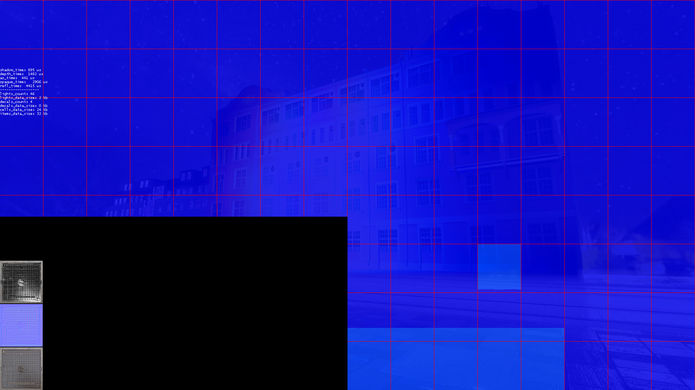

Personal playground for testing different realtime rendering stuff. Currently includes double-threaded renderer (doom3-like), software occlusion culling, cascaded shadow map, lightmapped global illumination, HDR and Android (OpenGL ES 3) support.

- Video : https://www.youtube.com/watch?v=6EyhDi7ROTM

|||
:-------------------------:|:-------------------------:|:-------------------------:|:-------------------------:

Also trying to add clustered lighting, decals, SSR and SSAO.

||
:-------------------------:|:-------------------------:|:-------------------------: