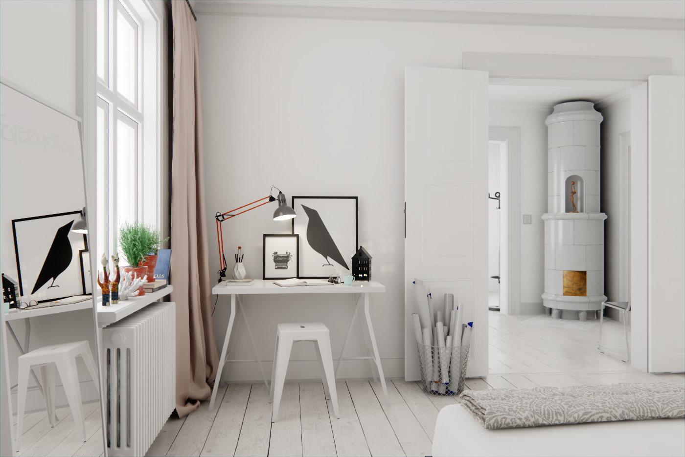
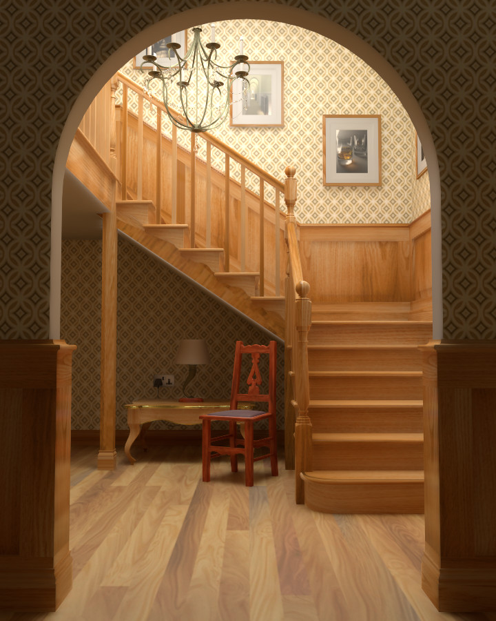
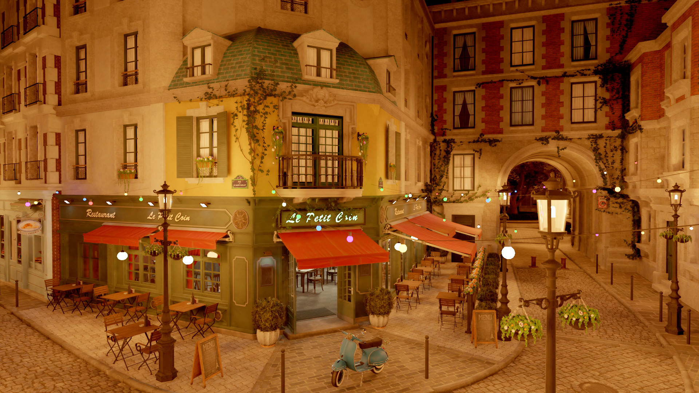
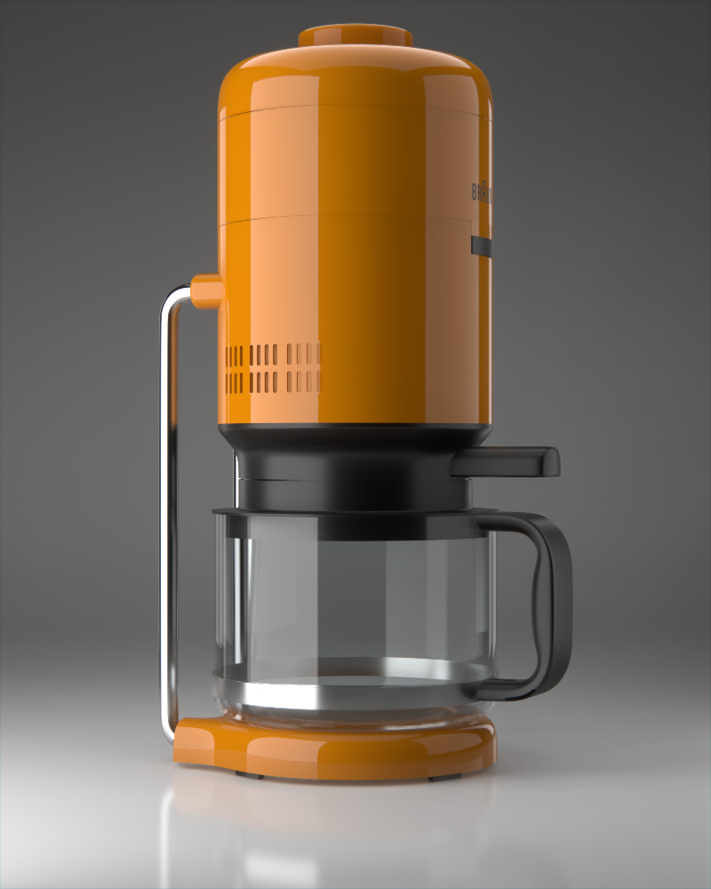
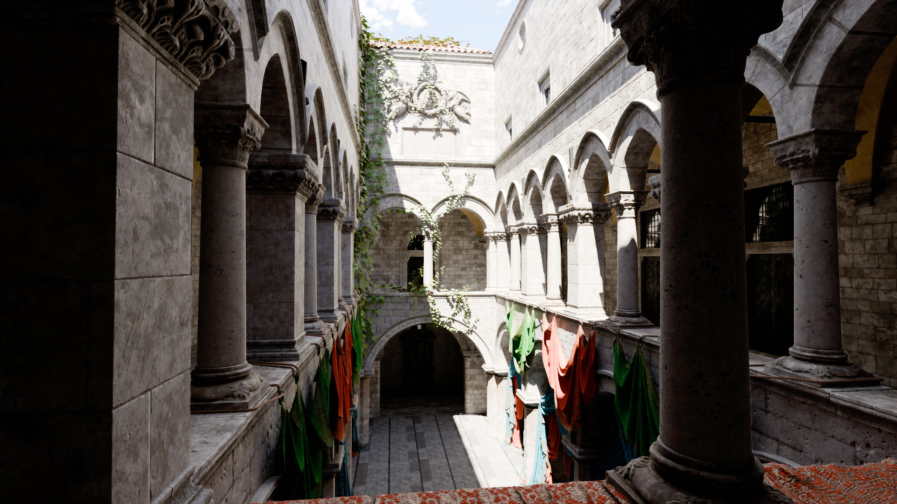

# DummyEngine

Cross platform Vulkan/OpenGL 3d engine for personal experimentation. Bundled with a lot of test scenes (using Git LFS).

Main reusable parts are extracted into the following libs:
- Realtime renderer: https://github.com/sergcpp/Eng
- Pathtracing renderer: https://github.com/sergcpp/Ray

  
Images (from realtime renderer)

  - Links to the original scenes: \
    Staircase, Coffee maker - https://benedikt-bitterli.me/resources/ \
    Sponza - https://www.intel.com/content/www/us/en/developer/topic-technology/graphics-research/samples.html \
    Bistro - https://developer.nvidia.com/orca/amazon-lumberyard-bistro \
    Interrior - https://evermotion.org/shop/show_product/scene-6-ai43-archinteriors-for-blender/14569

  

    

      
    

    

      
      
    

    

      
    

    

      
      
    

  

