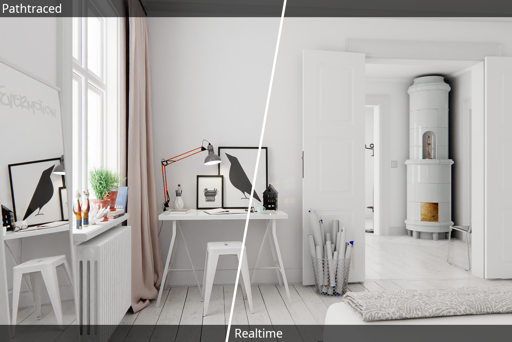

# DummyEngine

Cross platform Vulkan/OpenGL 3d engine for personal experimentation. Bundled with a lot of test scenes (using Git LFS).

Main reusable parts are extracted into the following libs:
- Realtime renderer: https://github.com/sergcpp/Eng
- Pathtracing renderer: https://github.com/sergcpp/Ray

