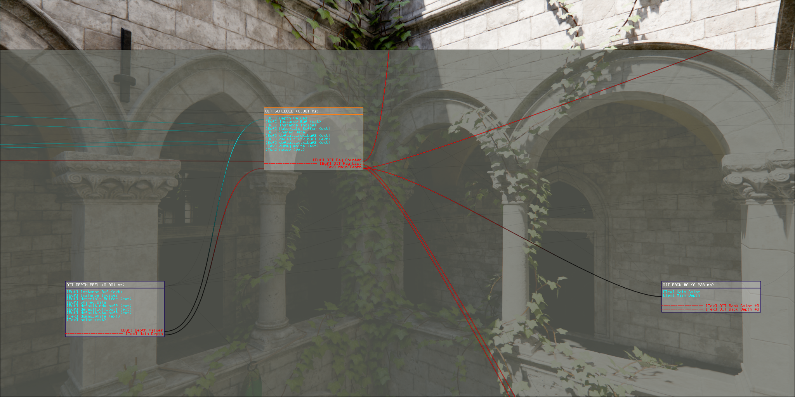

# Eng

Embeddable cross-platform realtime engine.

Features:
- Vulkan and OpenGL renderer backends
- Principled BSDF, LTC area lights, stochastic mesh lights
- Deferred and clustered forward render modes
- Temporal antialiasing
- Raytraced reflections, GI and shadows
- Hardware raytracing and software raytracing fallback
- Order-independent transparency
- Procedural sky
- Framegraph with automatic barrier placement and resource aliasing
- Dynamic BVH as main scene structure
- Occlusion culling based on software rasterization
- Simple ECS

  
Images

  

      

        
      

      

        
      

    

