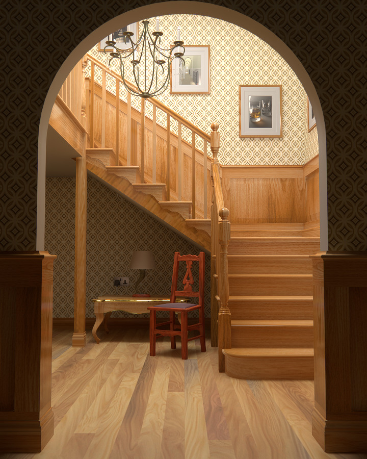
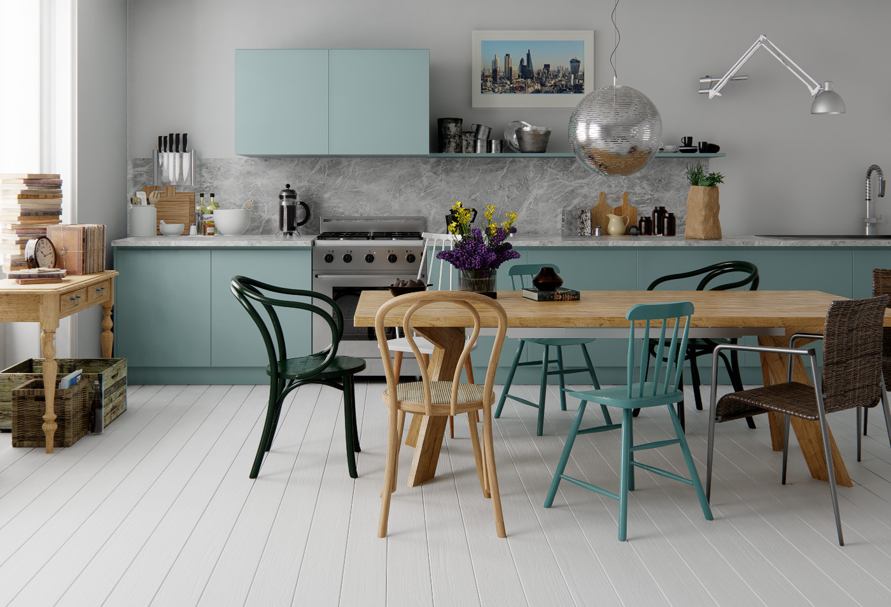
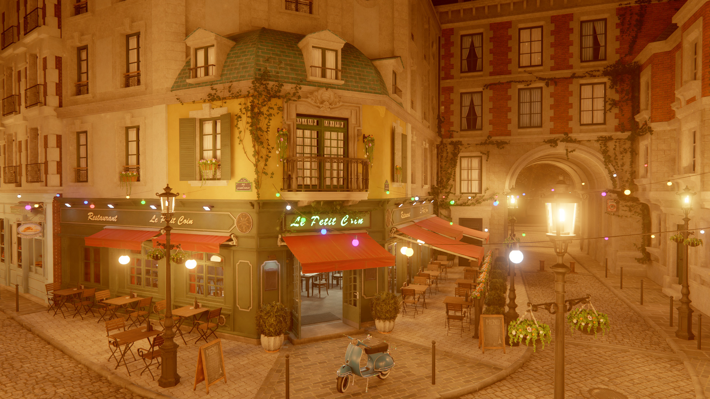
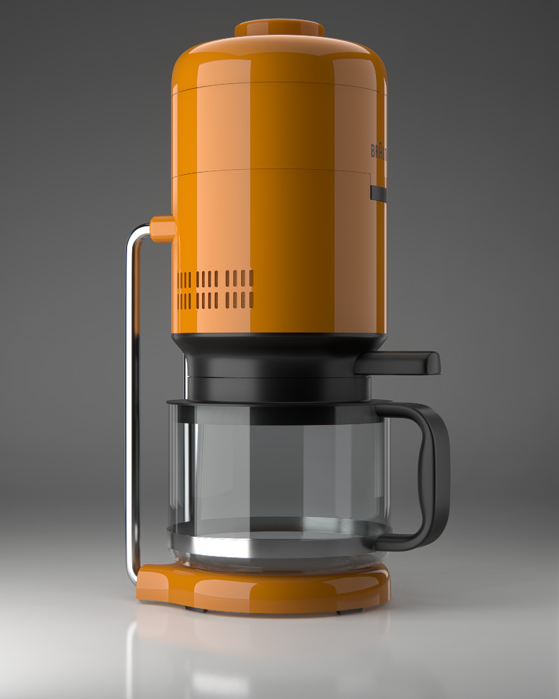
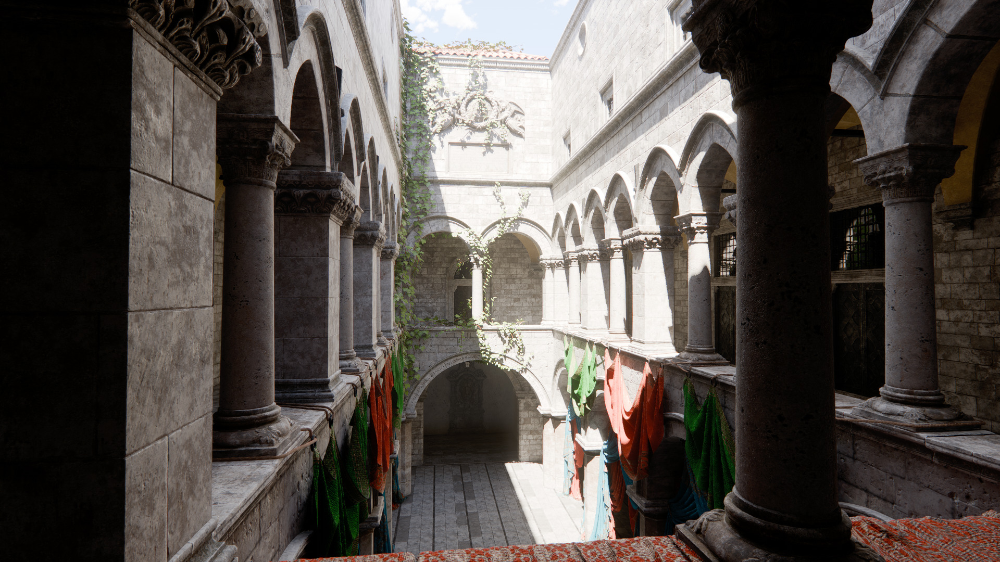
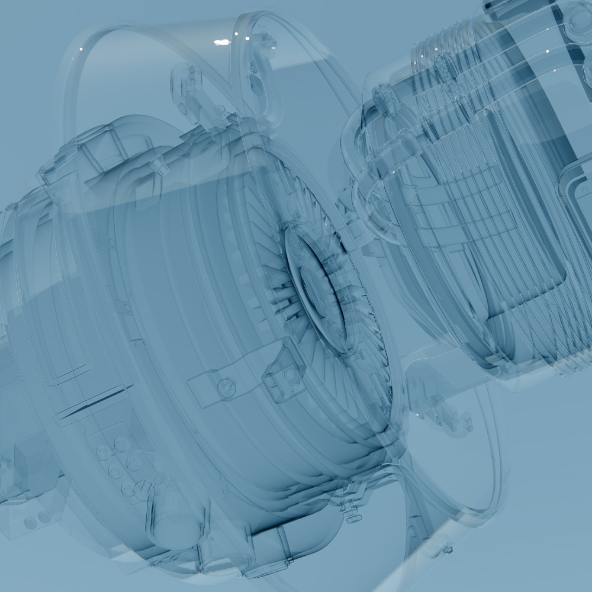

# Eng

Embeddable cross-platform realtime engine.

Features:
- Vulkan and OpenGL renderer backends
- Principled BSDF, LTC area lights, stochastic mesh lights
- Deferred and clustered forward render modes
- Temporal antialiasing
- Raytraced reflections, GI and shadows
- Hardware raytracing with software fallback
- Order-independent transparency
- Procedural sky model
- Framegraph for automatic barrier placement and resource aliasing
- Dynamic BVH as main scene structure
- Occlusion culling based on software rasterization
- Simple ECS

  
Images

  - Links to the original scenes: \
    Staircase, Coffee maker - https://benedikt-bitterli.me/resources/ \
    Sponza - https://www.intel.com/content/www/us/en/developer/topic-technology/graphics-research/samples.html \
    Bistro - https://developer.nvidia.com/orca/amazon-lumberyard-bistro \
    Transparent machines - https://www.beeple-crap.com/resources \
    Interrior - https://evermotion.org/shop/show_product/scene-6-ai43-archinteriors-for-blender/14569 \
    Kitchen - https://evermotion.org/shop/show_product/scene-1-ai43-archinteriors-for-blender/14564

  

    

      
    

    

      
      
    

    

      
      
    

    

      
      
    

    

      
      
    

    

      
    

  

